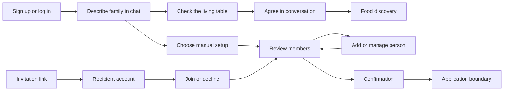

# Auth and family feature map

Use this map to drive authentication and family creation as a user and decide
what evidence a change needs. Stop at entry to the application after setup.
Recipe import, discovery interviews, planning, shopping, and other product areas
are outside this map.
At the application boundary, the next saved household journey is
[food profile review and correction](../food-profiles/README.md).

This inventory was checked against source on 2026-09-27, based on merged commit
`bc6eda2`. It is a maintained verification guide, not a claim that every path has
passed a live browser run. Each verification run must report its own results.

## Choose a feature

Walk these entries in order for an auth/family sweep. For a targeted change, use
the affected entries and their cross-feature journeys.

| Area | User goal | Entry |
| --- | --- | --- |
| [Authentication and recovery](authentication.md) | Create an account, log in/out, recover access | `/login`, `/signup`, `/forgot-password`, `/reset-password` |
| [Family setup](family-setup.md) | Name a family, review it, and finish setup | `/setup`, `/setup/family`, `/setup/review`, `/setup/ready` |
| [Family people](people.md) | Add, correct, invite, or remove a person | `/setup/people`, roster actions on review and Add someone |
| [Invitation response](invitations.md) | Join or decline as the intended account | `/invitation/$invitationId` |
| [Cross-feature journeys](journeys.md) | Check persistence, account isolation, and recovery | The routes above in sequence |



The invitation-to-members edge applies to joining; decline leaves the family
unchanged for that account. Completion does not make a family immutable.
The family rename API exists, but there is no dedicated family-rename screen in
this scoped UI. Do not confuse **Edit name** on a person with renaming a family.

## Launch and establish what you can prove

Use [local development](../../../how-to/local-development.md) to choose the runtime.
`pnpm dev` starts a catalogue API host, not this app. A frontend-only run is:

```sh
pnpm --filter @meal-planner/web dev --host 127.0.0.1 --port 4391 --strictPort
```

Use an unused port and the process you own. Check its startup output and origin
before driving. This command serves the frontend; it does not supply the API
Worker service binding. A full integration run needs an explicitly configured
same-origin Website/API Worker environment with auth D1 and household bindings.
Do not launch an Alchemy deployment to turn a UI check into an integration test.

For browser work, use a named `agent-browser` session. Read the installed driver's
core guide first. Set `AUTH_FAMILY_BASE_URL` to the verified instance URL, then:

```sh
export AGENT_BROWSER_SESSION="$(agent-browser session id --scope worktree --prefix auth-family)"
agent-browser open "$AUTH_FAMILY_BASE_URL/login"
agent-browser snapshot -i
```

Use fresh snapshot references and visible labels from each entry. Do not retain
example `@eN` references between page changes. Inspect the actual request path
and final screen; do not call component internals to manufacture a result.
For a full run, use disposable organizer, recipient, and unrelated accounts plus
a family owned by that run. Never use another person's household as test data.

## Repeatable integrated browser suite

Run `pnpm --filter @meal-planner/web test:e2e` for the scoped native Worker
journeys. [Local development](../../../how-to/local-development.md#run-the-auth-and-family-reference-journey)
lists prerequisites and a manual server command. The
[Playwright page objects](../../../../apps/web/e2e/pages/family-page.ts) own screen
interactions; [journey tests](../../../../apps/web/e2e/family-journey.spec.ts) own
cross-screen expectations. The suite now builds the Website through Alchemy and
runs in desktop Chromium and mobile WebKit.
[Session/concurrency journeys](../../../../apps/web/e2e/account-concurrency.spec.ts)
and [accessibility checks](../../../../apps/web/e2e/accessibility.spec.ts) cover
account isolation, expiry, competing edits, and keyboard focus. Mail is captured locally; no delivery is claimed.
Vitest DOM tests use Chromium browser mode, while pure and server tests retain
their own runtimes.

## Evidence and limitations

Record commit, origin, runtime, fixture/account roles, action, expected result,
observed result, and artifact paths. Redact credentials, reset tokens, invitation
links, and personal data from shared evidence. Keep local captures in an ignored
`artifacts/auth-family/` directory; stop only processes and sessions you started.

A screenshot proves appearance. A UI test with a synthetic API proves browser
behavior against that fixture. A native API test proves the exercised server
path. A real browser/API journey followed by reload proves the integrated path.
Do not substitute one kind of evidence for another.

The Worker composes Cloudflare Email Sending for reset mail; the household people
command submits invitation mail after association when the delivery gate is
enabled. A reset or invitation record,
or a provider send response, does not prove inbox delivery. Record provider
delivery and real mailbox receipt separately during E2E activation. See the
[email delivery plan](../../../plans/auth-email-delivery.md).

If the runtime, account, recipient link, or failure-injection facility is missing,
mark that path **not exercised**, state the missing prerequisite, and run the
available checks. Do not fabricate a seed endpoint, test credential, or full-app
startup command. The prior family refactor's browser fixture and native test
results are documented in [its plan](../../../plans/family-resource-onboarding.md).

## Maintain the map

Update the affected entry when routes, visible labels, permissions, states, or
observable outcomes change. Keep common setup here and feature-specific behavior
in its entry. Use the [intent layer](../../intent-layer.md) to find implementation
owners. Run `pnpm docs:check`; review linked source and relevant tests for accuracy.

This structure applies the feature-map approach from
[The Complete Guide to pstack Pt. 1](https://x.com/poteto/article/2094457600259842065)
and [the author's example](https://github.com/poteto/verification-skill-example).
The article was read through a public rendering after X denied direct retrieval.
It informed the user-path and evidence structure; this map's contents come from
Meal Planner's source. No pstack installation or scheduled maintenance is implied.
