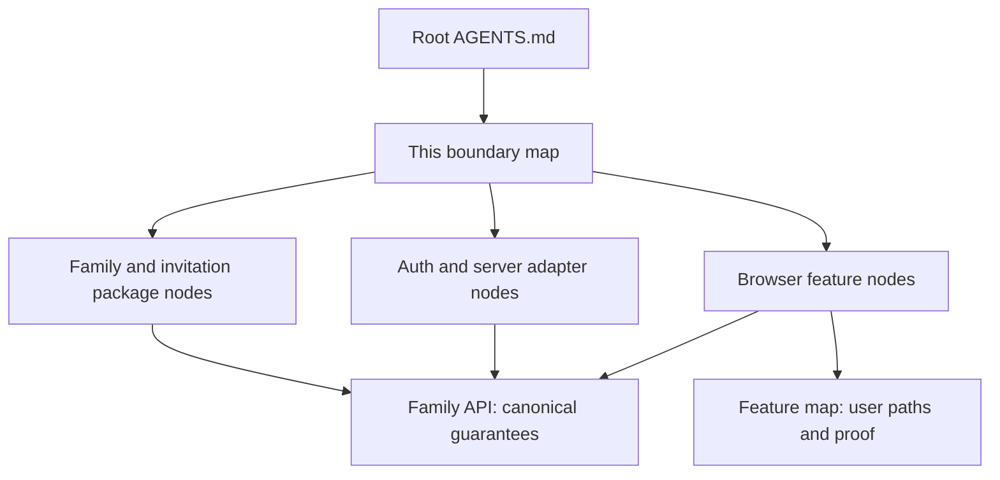

# Auth and family intent layer

Start here when changing authentication, family setup, people management, or
invitation acceptance. This map covers the reference architecture introduced in
PR #254. It makes no architectural claim about other application features.
For the first household feature after setup, use the
[food profile intent map](food-profile-intent-layer.md).

The intent layer is repository guidance for agents. Runtime import intents are
separate application code. A normal family remains a saved domain resource;
this documentation does not introduce a setup-intent entity.

## Find the responsible boundary

Read the root instructions, the applicable local node, and the specific reference
it links. Follow cross-boundary links when the change crosses that boundary.
Do not load every node for a small change. Files without a local node inherit
the nearest ancestor's instructions; do not assume a tool loaded sibling nodes.

| Change | Intent node | Related boundary |
| --- | --- | --- |
| Family values, contract, or application operation | [Family package](../../packages/families/AGENTS.md) | [Family server adapters](../../apps/api/src/features/families/AGENTS.md) |
| Invitation response contract or coordination | [Invitation package](../../packages/invitations/AGENTS.md) | [Invitation server adapters](../../apps/api/src/features/invitations/AGENTS.md) |
| Sessions, identity, native auth, or auth schema | [Server auth](../../apps/api/src/features/auth/AGENTS.md) | [Browser account](../../apps/web/src/features/auth/AGENTS.md) |
| Family queries, roster actions, or cache ownership | [Browser family](../../apps/web/src/features/family/AGENTS.md) | [Setup screens](../../apps/web/src/features/onboarding/AGENTS.md) |
| Recipient-facing invitation behavior | [Browser invitations](../../apps/web/src/features/invitations/AGENTS.md) | Invitation package and server adapters above |
| Password recovery | [Browser recovery](../../apps/web/src/features/recovery/AGENTS.md) | Server auth above |
| Browser/SSR API transport | [Web API runtime](../../apps/web/src/features/api-client/AGENTS.md) | Router composition and the web Worker entry |
| Retrying a submitted request in memory | [Browser request recovery](../../apps/web/src/features/request-recovery/AGENTS.md) | The feature that submits it |

The [family API reference](family-api.md) owns cross-boundary guarantees and
adapter composition. The [feature map](features/auth-family/README.md) owns the
user paths and verification expectations. The
[decision log](../plans/family-resource-onboarding.md) records why the architecture
changed. Local nodes contain only the decisions and pitfalls needed in that area.

The API host’s [auth/family composition](../../apps/api/src/auth-family.ts) is
shared with native browser tests. The [Website source inputs](../../apps/web/website-source.ts)
are shared with the [local Alchemy build](../../apps/web/scripts/build-worker.ts).
These are host assembly seams, not new domain layers.

## Keep it accurate

When changing a contract, dependency, entry point, or user-visible behavior:

1. Update the affected local node if its guidance changed.
2. Update the canonical reference or feature entry that owns the affected fact.
3. Check parent descriptions and cross-links; keep unrelated nodes untouched.
4. Run `pnpm docs:check` and the affected behavior checks. Record the evidence and
   any unexercised paths in the change, without calling a source review a live test.

Use a new node when responsibility or important constraints change at a directory
boundary. Do not add one to every folder, duplicate standards, or add parallel
`INTENT.md`/`CLAUDE.md` copies. Maintenance belongs with the change; this work does
not create a scheduled automation.

## Sources

[The Intent Layer](https://intent-systems.com/blog/intent-layer) informed the small
local nodes, linked context, and maintenance approach. Our boundaries and rules
come from the repository and the agreed family design, not the article's examples.
